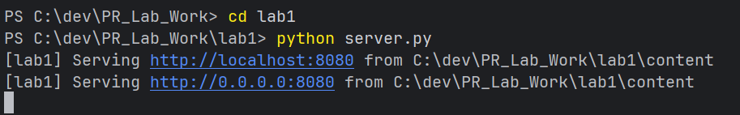
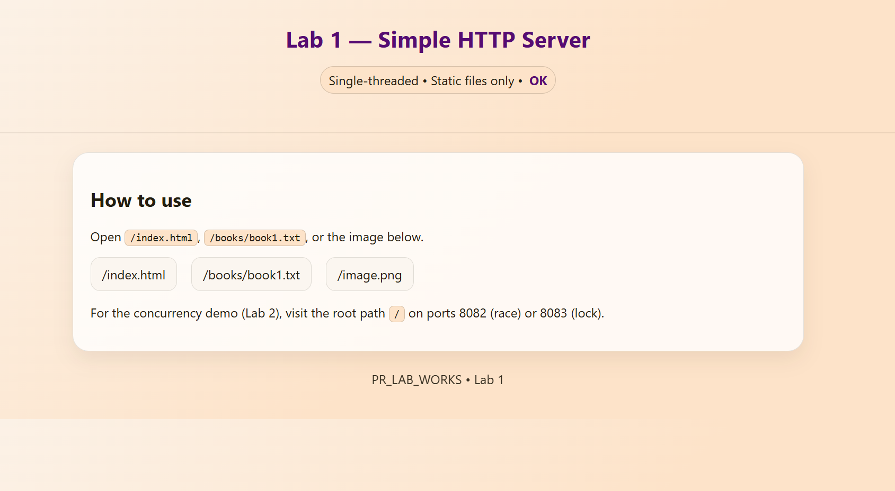
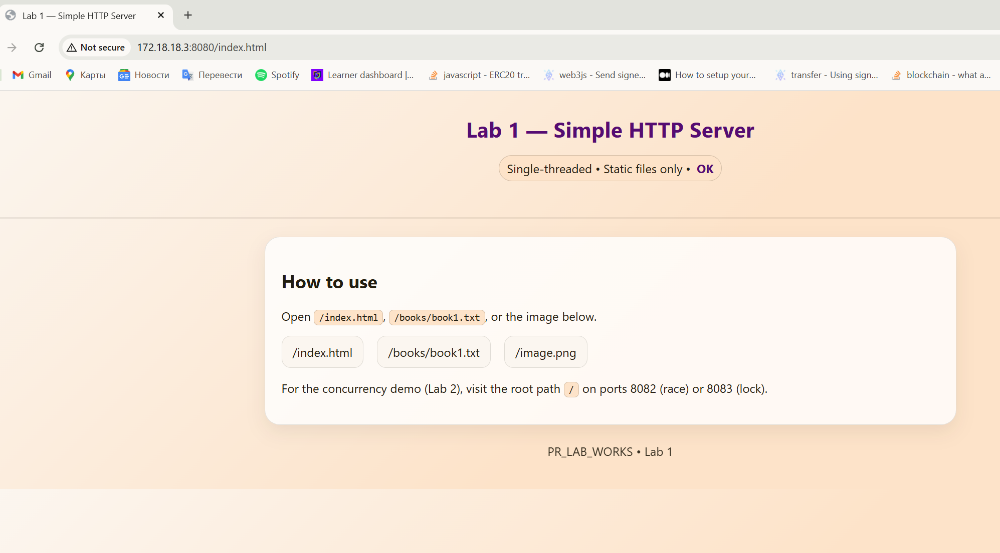
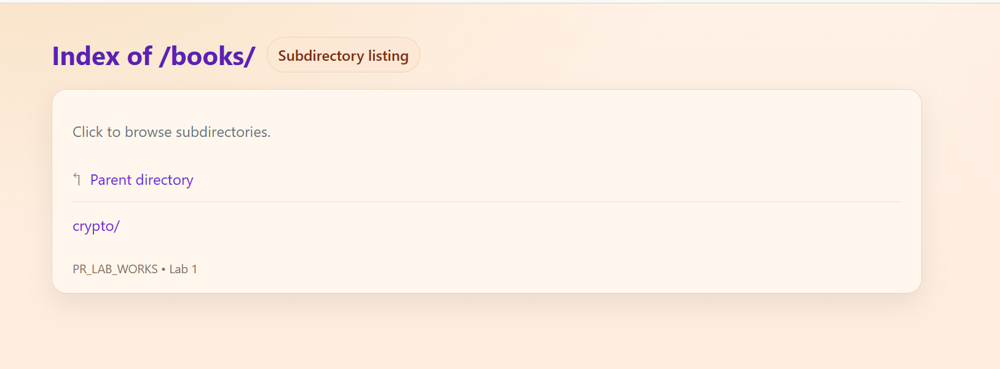
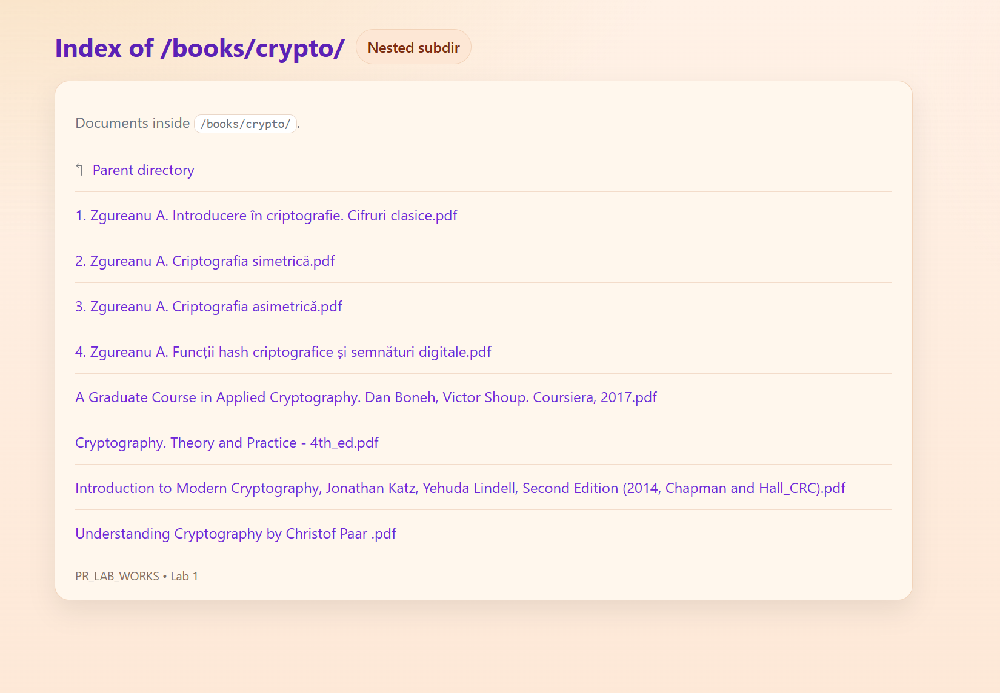
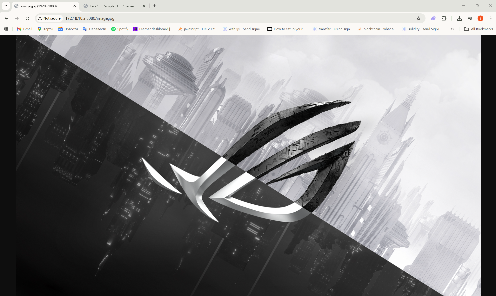
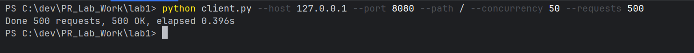

# Lab 1 — HTTP File Server (Single‑Threaded)

**Discipline:** PR / Networks & Protocols  
**Lab:** Serving static files over HTTP using raw TCP sockets (no frameworks).

## Objectives
- Implement a minimal HTTP/1.1 server with `GET` support.
- Serve files from a docroot with correct MIME types.
- Prevent directory traversal (`../`).
- Observe blocking behavior of a single‑threaded design.

## Stack
- Python 3.11 (stdlib only: `socket`, `mimetypes`)
- Docker + docker-compose

## Project Structure
```
lab1/
  Dockerfile
  server.py
  client.py
  content/
    index.html
    image.png
    books/
      book1.txt
```
## How to Run

### With Docker
```bash
docker compose up --build lab1
# open http://localhost:8081/index.html
```

### Locally (no Docker)
```bash
cd lab1
python server.py
# open http://127.0.0.1:8080/index.html
```

### Client run python
```
PS C:\dev\PR_Lab_Work\lab1> python client.py --host 127.0.0.1 --port 8080 --path / --concurrency 50 --requests 500
Done 500 requests, 500 OK, elapsed 0.396s
PS C:\dev\PR_Lab_Work\lab1> 
```

## Endpoints
- `/index.html` — landing page 
- `/books` — 
- `/image.jpg` — sample image

## Request Lifecycle 
1. `accept()` a TCP connection.
2. Read request line + headers until `\r\n\r\n`.
3. Validate method (`GET`), sanitize and map path to docroot.
4. Load file, infer `Content-Type`, compute `Content-Length`.
5. Send `HTTP/1.1 200 OK` (or `404/405/400`) and close.

## Security Notes
- Normalized joined path against fixed docroot → mitigates traversal.
- We close connection after response (`Connection: close`).

## Verification Checklist
- [x] Serves HTML, PNG, TXT with correct MIME.
- [x] GET only; other methods return `405`.
- [x] Single-threaded: parallel clients queue.
- [x] Safe path resolution.


### Screenshots


Shows the HTTP server starting up and listening on port 8080



Root directory and files


Shows the main index.html page being served in the browser




Lists the contents of the books subdirectory containing PDF files


Shows opening and viewing a photo from the server


Client run screenshot


