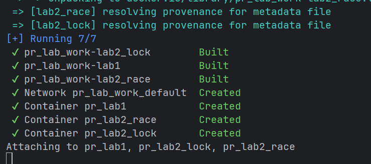

# Lab 2 — Concurrent HTTP Server (Threads)

**Discipline:** PR 

**Topic:** Thread‑per‑connection server 

**Focus:** Race condition vs mutex fix


---

## 1) Goals
- Accept multiple connections **concurrently** (thread‑per‑connection design).
- Maintain **per‑file request counters** stored in shared state.
- **Demonstrate a race condition** (no locking) and then **fix it** with a mutex.
- Compare behavior/performance with a **single‑thread baseline**.

---

## 2) Theory Recap
### Concurrency & shared state
- **Concurrency** allows overlapping work (e.g., serving multiple clients). Threads share memory; this makes communication cheap but introduces hazards.
- A **race condition** occurs when the correctness of a program depends on the timing of threads. In our case, two threads may read/update the same counter simultaneously and **lose updates**.
- The critical region is `counter[file] = counter[file] + 1`. Without exclusion, two increments can interleave like: `read 10 → read 10 → +1 → +1 → write 11` (should be 12).

### Mutual exclusion (mutex)
- A **mutex** (lock) ensures **only one** thread executes the critical section at a time: `lock → read → update → write → unlock`.
- This removes data races and guarantees counter correctness at the cost of potential contention.

### Throughput vs. latency (intuition)
- **Throughput** ↑ when we process requests in parallel (threads), until synchronization or CPU becomes a bottleneck.
- **Latency** may improve with parallelism, but mutex contention or heavy I/O can diminish gains. A small critical section keeps contention low.

---

## 3) Project Structure
```
lab2/
  Dockerfile
  docker-compose.yml

  # Servers
  server_single.py             # single‑thread baseline (optional)
  server_threaded.py           # thread‑per‑connection — RACE
  server_threaded_lock.py      # thread‑per‑connection — LOCK (mutex)

  # Client / Load
  client.py                    # load generator: concurrency, requests, path

  # Static content
  content/
    index.html
    image.png
    sample.pdf
    books/
      book1.txt
```

---

## 4) Quickstart (Docker)
**Prereqs:** Docker & Docker Compose.

```bash
# from repo root
cd lab2

# build & start race (8082) and lock (8083) variants
docker compose up --build lab2_race lab2_lock
```

**Endpoints**
- Race: <http://localhost:8082/>
- Lock: <http://localhost:8083/>

**Health check**
- Open `/books/book1.txt` in a browser or curl:

```bash
curl -i http://localhost:8082/books/book1.txt
curl -i http://localhost:8083/books/book1.txt
```

Stop:
```bash
docker compose down
```




---

## 5) Quickstart (Local, no Docker)
**Prereqs:** Python 3.11+

Terminal 1 — race:
```bash
python lab2/server_threaded.py
```
Terminal 2 — lock:
```bash
python lab2/server_threaded_lock.py
```
(Optional) Baseline single‑thread:
```bash
python lab2/server_single.py
```

Default ports can be configured in the files or via CLI flags if exposed.

---

## 6) Load Generator (client.py)
Run a local load to verify concurrency and race behavior.

**Arguments** (defaults shown):
```
--host localhost
--port 8082             # choose 8082 (RACE) or 8083 (LOCK)
--path /books/book1.txt
--concurrency 50
--requests 500
--timeout 5             # (if implemented) per request socket timeout
```

**Example:**
```bash
python lab2/client.py --port 8082 --concurrency 50 --requests 500
python lab2/client.py --port 8083 --concurrency 50 --requests 500
```


**Output (example):**


---

## 7) Experiments & What to Observe

**Sample Results Table** (illustrative; fill with your numbers)

| Variant | Concurrency | Requests | Time (s) | Throughput (req/s) | OK | Lost updates? |
|--------:|------------:|---------:|---------:|--------------------:|---:|:--------------|
| RACE    | 50          | 500      | 4.2      | 119                 | 500| **Yes**       |
| LOCK    | 50          | 500      | 4.4      | 114                 | 500| No            |
| SINGLE  | 1           | 50       | 50.0     | 1.0                 | 50 | N/A           |


---

## 8) Implementation Notes
- **Parsing:** Minimal HTTP/1.0/1.1 parsing sufficient for static files; `Content-Type` inferred by extension.
- **Threading model:** Accept loop on a listening socket; **spawn a thread** per accepted connection.
- **Shared state:** `dict[str,int]` maps `path → request_count`.
- **Race variant:** increments without synchronization → non‑deterministic counters.
- **Lock variant:** `threading.Lock()` protects `counter[path]++`.
- **Graceful shutdown:** (optional) catch signals and dump counters.

---


